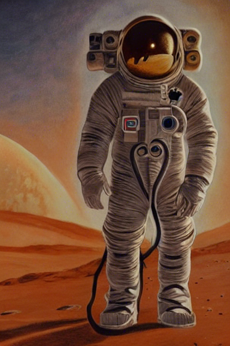
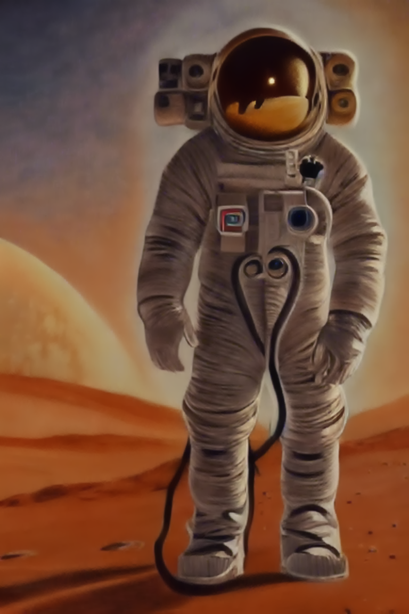

# Magic Wonder Diffusion
*Magic stable diffusion is a fork from Stable Diffusion, please, read the next website to know more about the original software([README LITTLE APPRENTICE](https://github.com/CompVis/stable-diffusion)).*

## Objectives
*Magic Wonder Difussion pursues the next objectives:*
* Allow the possibility to generate big images in computers with less VRAM.
* Become the AI image generation in something more accessible to all the people.

## ¿How to use it?
*All the parameters from stable diffusion are compatible, Magic Wonder Difussion has the next own parameters:*
* --resize(Default 2): The upscale factor for the resized and improved version
* --nsfw_protection(default 0): Non safe for work flag
* --watermark_protection(default 0): Watermark flag

*NOTE: The output in Magic Wonder Difussion is in three folders; original, resized, and improved*

## Roadmap
*The next roadmap is one estimation, some new features can be added in a different order:*
* Modify img2img to allow half precision => February-March
* Add one video2img feature. => February-March-May
* Create one basic user friendly UI => May
* Improve resize features => Unknow
* Add one dictionary to control prompts => Unknow
* Create one original model for Magic Wonder Diffusion => Unknow
* ;)

## Examples
```
--prompt "An oil picture about one vintage astronaut in mars" --plms --n_iter 10 --n_samples 1 --ckpt YOUR_DRIVE:/YOUR_ROUTE/model.ckpt --ddim_steps 200 --H 576 --W 384 --resize_factor 2 --nsfw_protection 1
```
*The next examples are related to the original, resized, and improved version*


!

